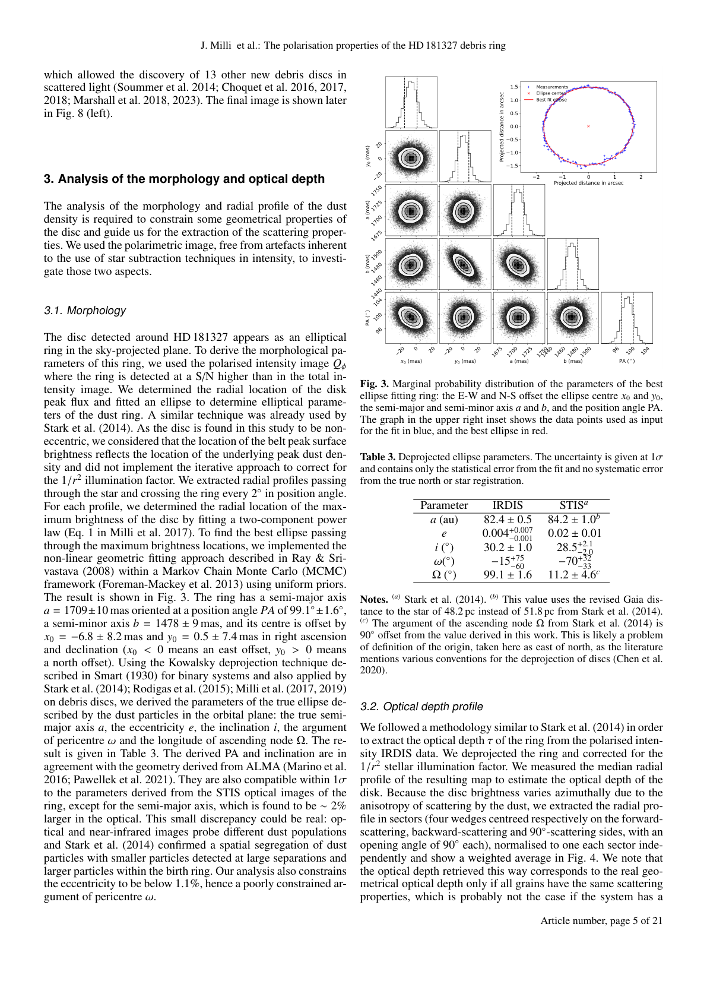
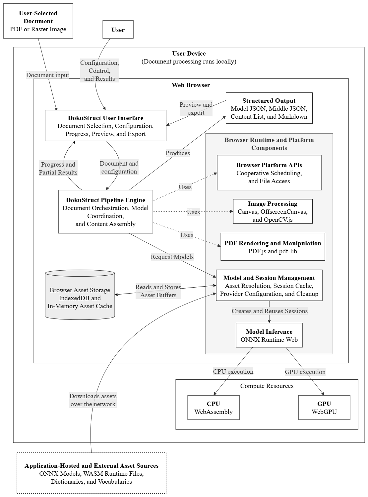

# DokuStruct

    

DokuStruct runs document extraction in your browser. Drop a PDF and get Markdown and JSON. Text, tables, and math are found on your device. Nothing is uploaded.

It is a direct port of [RapidDoc](https://github.com/RapidAI/RapidDoc) (from [MinerU](https://github.com/opendatalab/MinerU)) to JavaScript. All parsing runs locally with ONNX Runtime Web. This is my Computer Science thesis. I kept the Python as a reference and rewrote `rapid_doc` file by file so behavior stays the same. Each JS file has a short note at the top.

[Open the app](https://dokustruct.vercel.app) · [Porting notes](docs/porting-decisions.md) · [Technical insights](docs/technical-insights.md) · [Evidence](docs/evidence/)



Models are cached in IndexedDB after the first load. Core is about 285 MB, with formulas about 550 MB. Next loads start from cache.

---

## Why this exists

Many documents are still scanned PDFs with tables, math, and multi-column layout. Linear text extraction loses the structure. Server-side needs upload and network. Native local needs install and setup. I wanted to see if the full pipeline can run where the file already is, in the browser, using WebAssembly, WebGPU, and ONNX Runtime Web, and then measure how close it stays to the Python version. This repo is the artifact and the measurement.

## What it does

* OCR with PP-OCRv5, keeps reading order
* Layout with PP-DocLayout V2, V3, and Plus L
* Math as LaTeX with PP-FormulaNet Plus S and M
* Tables with SLANet-Plus and UNet
* Orientation fix, batch of files, export to Markdown and JSON
* Works offline after the first model download

## Quick start

```bash
git clone https://github.com/boyaditya/dokustruct.git
cd dokustruct
npm install
npm run dev
# http://localhost:5173
```

```bash
npm run build   # production build
npm run preview # preview build
npm test        # 240 tests
npm run lint    # eslint
```

## How it works

```
PDF or image
  -> page slicing
  -> layout (PP-DocLayout)
  -> OCR (PP-OCRv5 det + rec)
  -> formula and table
  -> reading order (XY-Cut)
  -> Markdown / Content List / Middle JSON
```

Large PDFs are split into small windows. The app yields between windows so the UI stays responsive. WebGPU is used when available, otherwise WASM.

### Architecture



The diagram shows the full browser-local flow. The user selects a document and interacts with the Web Browser. The DokuStruct User Interface handles selection, configuration, progress, preview, and export, while the DokuStruct Pipeline Engine orchestrates the document, coordinates models, and assembles content. The engine uses Browser Runtime and Platform Components (cooperative scheduling and file access, Canvas and OpenCV.js, PDF.js and pdf-lib) and Model and Session Management (asset resolution, session cache, provider configuration) which in turn drives Model Inference via ONNX Runtime Web on CPU (WebAssembly) or GPU (WebGPU). Structured output (Model JSON, Middle JSON, Content List, and Markdown) is produced for preview and export. Assets (ONNX models, WASM files, dictionaries) are downloaded once from Hugging Face and cached in Browser Asset Storage (IndexedDB and in-memory).

```
rapid_doc/        # JS port, 188 files
  backend/pipeline/  # pipeline and batching
  model/             # OCR, layout, formula, table
  utils/             # PDF, image, geometry
  index.js           # public API

ui/               # vanilla JS app, 24 files
  app.js, state/, render/, linking/, history/

python/           # reference copy, 267 files
  rapid_doc/      # same shape as JS
  demo/           # batch runners

benchmark/        # scoring, sampling, Excel workbooks
tests/            # vitest suite
public/samples/   # 4 demo files
```

Each module in `rapid_doc` has a matching file in `python/rapid_doc` with the same interface. The header in each JS file says what was preserved, what was adapted for the browser, and what is new.

**Scope as a thesis artifact:** the pipeline covers orientation, layout, OCR, formula, table, reading order, and Markdown with the same pretrained weights as Python. No new models or datasets. RapidDoc 0.9.4 is the baseline. Python is not ground truth, OmniDocBench is. The corpus is 350 pages for output and 50 for timing. Official OmniDocBench evaluators that need TeX Live are replaced with a proxy. Timing is a deployment comparison, not a language claim. Tested on one device, one OS, and one browser.

### Using it as a library

```js
import { docAnalyze } from './rapid_doc/index.js';

const bytes = await file.arrayBuffer();
const { markdown, contentList } = await docAnalyze(bytes, {
  formula_enable: true,
  table_enable: true,
});
```

Models are described in `rapid_doc/utils/model_url_map.js` and fetched from Hugging Face `boyaditya/document-parsing-project`, then cached in IndexedDB (`rapiddoc_model_cache`). You do not need to download them manually.

### Browser notes

Chrome 121+ with WebGPU is fastest. Firefox and Safari fall back to WASM. Large PDFs can be heavy on mobile. The app requires `Cross-Origin-Opener-Policy: same-origin` and `Cross-Origin-Embedder-Policy: credentialless` for `SharedArrayBuffer`. See `vercel.json` and `vite.config.js`.

### Limits

Same weights as Python, so accuracy is close but not identical. Speed is slower in the browser, most of it on formulas and tables. Very large or low-resolution scans can miss layout.

## Tech stack

ONNX Runtime Web 1.24.3 (WASM + WebGPU), PDF.js 4.5 + pdf-lib, KaTeX 0.16 + Marked 14, OpenCV.js 4.10, Vite 7, Vitest 4.

---

## Benchmark

Tested on OmniDocBench v1.6 (1,651 pages). I sampled 350 pages for output and 50 for timing, seed 42, stratified by `data_source` and `language`.

**Port fidelity, JS vs Python, N=350, Python as reference:**

| Metric | Mean | Median | N |
| :--- | :--- | :--- | :--- |
| Coverage F1 | 0.9528 | 1.0000 | 350 |
| Type consistency | 0.9971 | 1.0000 | 350 |
| Text similarity | 0.8814 | 1.0000 | 344 |
| Formula similarity | 0.8888 | 1.0000 | 67 |
| TEDS / TEDS-Struct | 0.9069 / 0.9504 | 1.0000 | 105 |
| BBox IoU | 0.9021 | 0.9626 | 349 |
| Kendall tau | 0.9428 | 1.0000 | 332 |

**Accuracy vs OmniDocBench ground truth, proxy composite, N=348:**

| Metric | JS | Python | diff |
| :--- | :--- | :--- | :--- |
| Proxy composite | 71.69 | 74.29 | -2.59 |
| Text Edit | 0.268 | 0.238 | +0.030 |
| Formula Edit | 0.454 | 0.440 | ns |
| Table TEDS | 0.728 | 0.739 | ns |

Proxy composite is the mean of available components per page (TextEdit, TEDS, and normalized LaTeX edit as CDM proxy). It is not the official Overall `((1-TextEdit)*100+TEDS+CDM)/3`. The official CDM needs TeX Live.

**Timing, N=50, geomean, 3 warmup + 10 runs:**

|  | JS | Python | ratio |
| :--- | :--- | :--- | :--- |
| Total | 7.58s | 3.81s | 1.80x |

Formula is the bottleneck. Full workbooks, per-document and per-layout CSVs, and stratification proof are in `docs/evidence/`. Method, CIs, and sample-size notes are in `benchmark/README.md`.

The three evaluations are independent: port fidelity (JS vs Python), accuracy (system vs ground truth), and timing (same device). High fidelity does not automatically mean high accuracy.

---

## Reproduce

### 1. Python reference

`python/` is a minimal copy, about 3 MB, enough to run the benchmark:

```bash
python -m venv .venv
# Windows: .venv\Scripts\activate
# macOS/Linux: source .venv/bin/activate

pip install -e ./python
pip install -r benchmark/requirements.txt
python -c "import rapid_doc; print(rapid_doc.__version__)"
```

The runners are `python/demo/demo_batch.py` and `demo_run.py`:

```bash
PYTHONPATH=python python -m demo.demo_batch --pdfs path/to/pdfs --repeat 10 --warmup 2 --formula --table
node benchmark/js_supervised_runner.mjs --help
```

### 2. Fetch OmniDocBench from Hugging Face

OmniDocBench v1.6 lives at `opendatalab/OmniDocBench` on Hugging Face as a dataset. You need `OmniDocBench.json` and `images/` (1,651 JPGs, about 1.6 GB). Use the current `hf` CLI:

```bash
pip install -U "huggingface_hub[cli]"

hf download opendatalab/OmniDocBench --repo-type dataset --local-dir ./omnidocbench --local-dir-use-symlinks False

ls ./omnidocbench
# OmniDocBench.json
# images/  (1651 JPGs)
```

`--local-dir-use-symlinks False` materializes files on Windows without symlinks. This is the only download step you need. The app’s models are fetched automatically on first use from `boyaditya/document-parsing-project` and cached in IndexedDB.

If `hf` is not found, your `huggingface_hub` is old. Update it or use `huggingface-cli download` with the same arguments.

### 3. Build the ground-truth index and sample

```bash
python -m benchmark.omnidocbench --gt-json ./omnidocbench/OmniDocBench.json --out-dir benchmark/omnidocbench_gt
# -> benchmark/omnidocbench_gt/omnidocbench_index.json + 1651 *_content_list.json

python -m benchmark.sampler --index benchmark/omnidocbench_gt/omnidocbench_index.json --images ./omnidocbench/images --out-dir benchmark/sample --accuracy-n 350 --timing-n 50 --seed 42
# -> benchmark/sample/accuracy_images/ (350 images, 1 run)
# -> benchmark/sample/timing_images/    (50 images, 10 runs)
# -> benchmark/sample/sample_manifest.json (archive this with results)
```

`sampler.py` is `data_source × language` stratified, min 3 per stratum, largest-remainder, seed 42. Change `--accuracy-n` / `--timing-n` to match the table in `benchmark/README.md` or the output of `benchmark/sample_size.py`.

### 4. Run both systems and score

Process the sampled images with both systems on the same files, then score:

```bash
# Accuracy: 1 run, ground-truth mode
PYTHONPATH=python python -m demo.demo_batch --pdfs benchmark/sample/accuracy_images --benchmark-dir benchmark/py_accuracy --repeat 1 --no-warmup --formula --table --no-evaluate
# JS: drop accuracy_images into benchmark.html (repeat 1) -> export to benchmark/js_accuracy

python -m benchmark.evaluate --js-dir benchmark/js_accuracy --py-dir benchmark/py_accuracy --gt-dir benchmark/omnidocbench_gt --manifest benchmark/sample/sample_manifest.json --manifest-split accuracy --report-mode accuracy_final --output benchmark/results_accuracy.xlsx

# Timing: 10 runs + warmup
PYTHONPATH=python python -m demo.demo_batch --pdfs benchmark/sample/timing_images --benchmark-dir benchmark/py_timing --repeat 10 --warmup 2 --benchmark-mode final --formula --table --no-evaluate
# JS: benchmark.html?benchmarkMode=final, drop timing_images, repeat 10, warmup 2 -> export to benchmark/js_timing

python -m benchmark.evaluate --js-dir benchmark/js_timing --py-dir benchmark/py_timing --manifest benchmark/sample/sample_manifest.json --manifest-split timing --report-mode timing_final --output benchmark/results_timing.xlsx
```

Or score JS directly against Python without ground truth:

```bash
python -m benchmark.evaluate --js-dir benchmark/js_results --py-dir benchmark/py_results --output benchmark/results.xlsx
```

See `benchmark/README.md` for metric definitions, geomean, Wilcoxon + Holm, bootstrap, and how to size a pilot with `benchmark/sample_size.py`.

---

## License

Derivative of MinerU and RapidDoc. AGPL YOLO models were replaced with PP-StructureV3 ONNX models.

Apache 2.0, see `LICENSE`.

## Credits

MinerU, RapidDoc, PaddleOCR, RapidOCR, ONNX Runtime. Built solo for my Computer Science thesis. If it helps, star it. If it breaks, open an issue.
